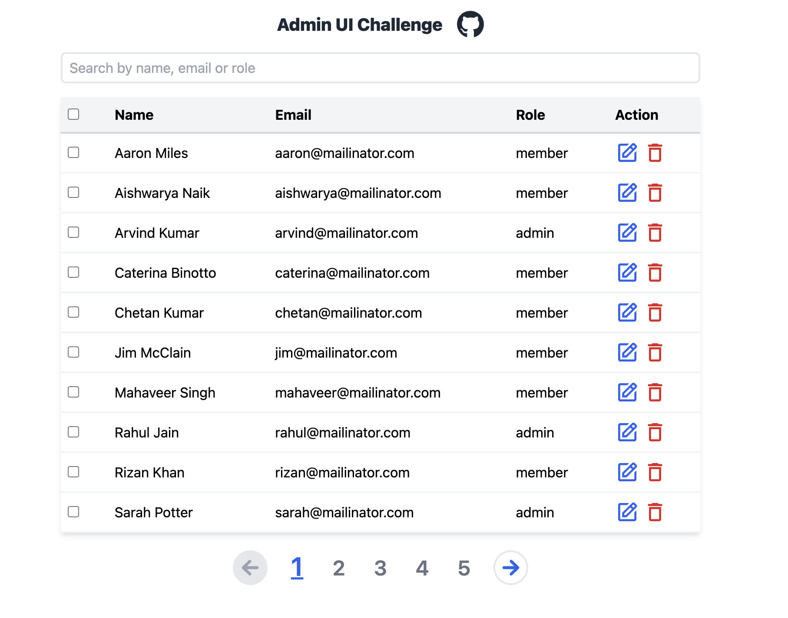
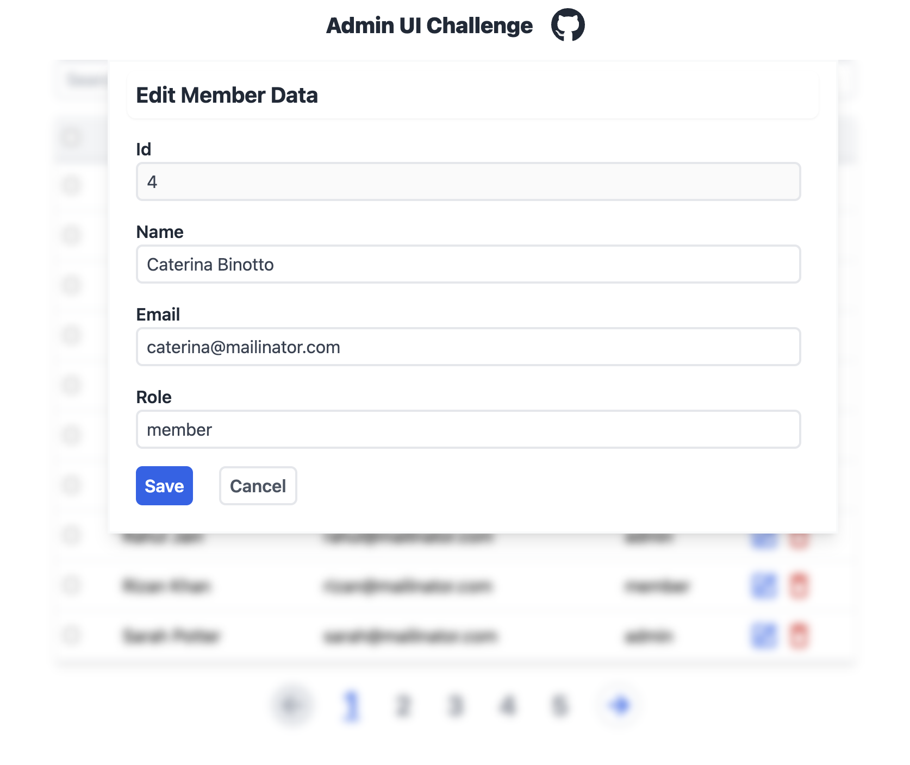

# Admin UI challenge geektrust

Project is hosted live using [_**Netlify!**_](https://adminui-challenge-geektrust-dhananjay.netlify.app/)

### Screenshot

> Admin UI Dashboard

> Edit User Dashboard

### Steps to run the project

1.  `npm install`
2.  `vite run dev`

Project is hosted live using [_**Netlify!**_](https://adminui-challenge-geektrust-dhananjay.netlify.app/)
